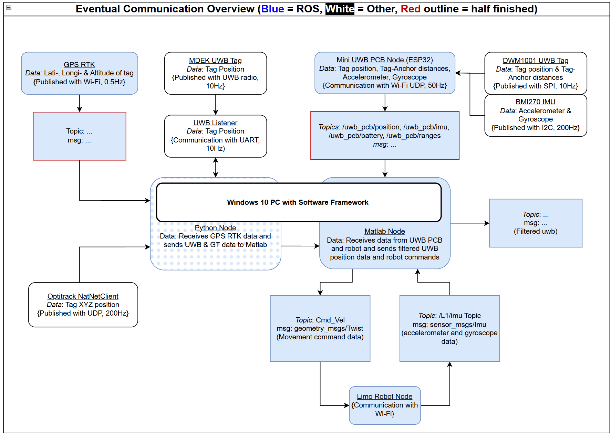
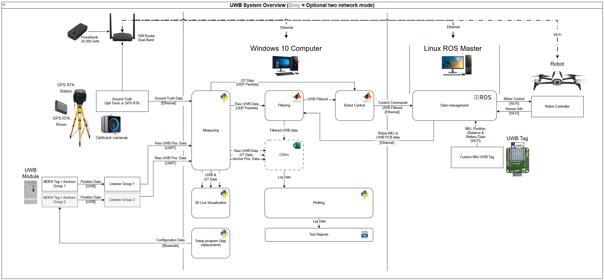

UNIFIED SOFTWARE FRAMEWORK
=======================================================================================================================

- Author: Renzo Eisma
- Date last revision: 06/2026
- Lab: LAB-AIR - UFES - Espirito Santo
- Project: Robot localization and control based on a UWB radio system
- Repository purpose: Software framework for reading, logging, filtering, plotting and using UWB localization data

-----------------------------------------------------------------------------------------------------------------------
I. PROJECT OVERVIEW
-----------------------------------------------------------------------------------------------------------------------

This repository contains the software framework developed for the UWB localization project at LAB-AIR. The framework was
created during a graduation internship at UFES and is intended to make UWB testing, validation and robot-control
experiments easier to repeat.

The project uses Qorvo / Decawave DWM1001C and MDEK1001 UWB modules with the PANS firmware. The software can read UWB
data from listener modules, compare it against ground-truth systems such as OptiTrack and GPS RTK, generate measurement
reports, filter UWB data in MATLAB, and send the resulting position to ROS 1 for robot control.

The framework consists of two main parts:

1. Python environment
   - Main GUI and measurement control station.
   - UWB serial reading.
   - OptiTrack NatNet reading.
   - GPS RTK reading from ROS.
   - UWB module Bluetooth configuration.
   - HTML measurement report generation.
   - Session folder creation and raw CSV logging.

2. MATLAB environment
   - Receives data from Python over UDP.
   - Reads robot state / IMU data where needed.
   - If enabled, reads UWB and IMU data from ROS 1 from a custom designed DWM1001C PCB
   - Applies UWB filtering.
   - Performs robot control for the Bebop 2 drone and Limo ground robot.
   - Publishes filtered position data to a ROS 1 master

Python sends measurement data to MATLAB over UDP. MATLAB does not send data back to Python in the current structure.
ROS 1 is used as the communication layer between the localization software and the robot-control environment.

This README is written for future LAB-AIR users first, but it should also be useful for other students or researchers who
find this repository online and want to understand the software framework.

For the full engineering context, research, design choices, test results and project conclusions, see the graduation
report and the additional project documentation delivered with the internship.

-----------------------------------------------------------------------------------------------------------------------
II. TABLE OF CONTENTS
-----------------------------------------------------------------------------------------------------------------------

1. System Architecture
2. Installation and Setup Guide
3. User Guides
4. Data Output Schema
5. Python Script Explanations
6. MATLAB Script Explanations
7. ROS and Robot Commands
8. Troubleshooting / Common Errors
9. AI Assistance and Code Authorship
10. Current Status and Future Work
11. Version History

-----------------------------------------------------------------------------------------------------------------------
1. SYSTEM ARCHITECTURE
-----------------------------------------------------------------------------------------------------------------------

[1.1] Broad system overview

The framework connects several localization and robot-control systems into one workflow. Before this framework, UWB
reading, OptiTrack reading, plotting, filtering and robot control were handled by separate scripts or tools. This made
measurements slower and made it harder to repeat tests in a consistent way.

The current framework centralizes the workflow:

- The user starts measurements from MasterControlStation.py.
- Python starts the selected sensor readers.
- Sensor readers log raw data into a session folder.
- Python optionally sends live UWB and ground-truth data to MATLAB over UDP.
- MATLAB optionally reads data from connected robot and / or custom UWB PCB.
- MATLAB filters the UWB data and can publish or use the filtered result in ROS.
- The report maker generates an interactive HTML report from the recorded CSV files.

[1.2] Main data flow

```text
UWB Listener
        |
        v
Python sensor reader
        |
        |-- raw CSV log in measurements/Session_...
        |
        |-- UDP to MATLAB port 5005
        v
MATLAB filtering
        |
        |-- filtered CSV log
        |
        |-- ROS 1 publishing / robot control
        v
Robot control or analysis
```

Ground truth follows a similar path:

```text
OptiTrack / GPS RTK
        |
        v
Python ground-truth reader
        |
        |-- raw CSV log in measurements/Session_...
        |
        |-- UDP to MATLAB port 5006
        v
MATLAB comparison / control / logging
```

Here is a block diagram of the data flow:


[1.3] Text block diagram

A block diagram of the full system was made



[1.4] Why Python and MATLAB are both used

Python is used for the main application because it is practical for GUI development, serial communication, CSV logging,
network communication and report generation. It also makes it easier for future students to modify the sensor readers and
measurement workflow.

MATLAB is used because existing LAB-AIR control and filtering work already used MATLAB and ROS Toolbox. The MATLAB side
therefore handles filtering, ROS publishing and experimental robot control. This split avoids rewriting all existing
MATLAB/ROS work in Python while still giving the project a more user-friendly Python front end.

[1.5] Main UDP ports

The Python and MATLAB parts communicate locally over UDP.

```text
Purpose                         IP              Port
MATLAB settings packet           127.0.0.1       5004
Live UWB data to MATLAB          127.0.0.1       5005
Live ground-truth data to MATLAB 127.0.0.1       5006
```

Other important ports:

```text
Purpose                         Port
OptiTrack NatNet command         1510
OptiTrack NatNet data            1511
ROS master                       11311
rosbridge websocket              9090
```

-----------------------------------------------------------------------------------------------------------------------
2. INSTALLATION AND SETUP GUIDE
-----------------------------------------------------------------------------------------------------------------------

[2.1] Windows computer setup

The Windows computer is the main operator computer. It runs the Python GUI and MATLAB.

Required software:

- Python 3.14.4
- MATLAB with required toolboxes (ROS Toolbox, Instrument Control Toolbox, TCP/UDP/IP communication support)
- PyCharm or Visual Studio Code, optional but recommended
- DRTLS app for some DWM1001/PANS network configuration tasks

Recommended Python setup from the repository root:

```bash
python -m venv .venv
.venv\Scripts\activate
pip install --upgrade pip
pip install -r requirements.txt
```

Start the main GUI:

```bash
python MasterControlStation.py
```

The first time the GUI starts, check and save the local settings:

- UWB COM ports
- OptiTrack server IP
- OptiTrack local client IP
- GPS RTK settings, if used
- MATLAB routing checkbox
- read mode: Tag Position or Tag Distances
- network scale: 1 Network / 1 Listener or 2 Networks / 2 Listeners


The main MATLAB script is:

```text
MatlabMasterUWBControl.m
```

Normal order:

1. Open MATLAB.
2. Open the folder containing the MATLAB scripts.
3. Start `MatlabMasterUWBControl.m`.
4. Start logging from `MasterControlStation.py`.
5. Python sends the settings packet and live sensor data to MATLAB.

MATLAB should be started manually. The Python GUI does not start MATLAB automatically in the current version.
This could be achieved in the future with MatlabEngine.

[2.2] Linux ROS 1 computer setup

The robot side uses ROS 1 on Ubuntu. The exact ROS distribution depends on the LAB-AIR computer, but the README assumes a
normal ROS 1 setup.

Basic ROS setup:

```bash
source /opt/ros/<ros_distro>/setup.bash
roscore
```

Example for a Noetic installation:

```bash
source /opt/ros/noetic/setup.bash
roscore
```

When Python needs to read ROS topics over the network, start rosbridge on the Linux ROS computer:

```bash
roslaunch rosbridge_server rosbridge_websocket.launch
```

The default rosbridge port is usually:

```text
9090
```

[2.3.1] UWB sensor setup MDEK

The current UWB setup is based on Qorvo / Decawave DWM1001C or MDEK1001 modules running PANS firmware.

Basic setup:

1. Create an anchor network setup according to the chosen test plan.
2. Measure and save the anchor coordinates.
3. Configure the anchors and tag in the same UWB network.
4. Put one listener per active network into a USB port on the Windows computer.
5. Fill in the listener COM ports in `MasterControlStation.py`.
6. Choose the correct read mode (one or two networks)

[2.3.2] UWB sensor setup Custom PCB (unfinished)

In this setup, the custom UWB PCB tag is used. The tag should be configured into a network like normal. But some
additional steps have to be taken.

1. Connect the Linux ROS PC to the ESP32 on the PCB. 
2. Read out data via UDP on ROS
3. Choose ROS in the selection menu in the GUI

//It is important to note that this description above is what it should be like. Currently ROS is not implemented, but a
test has been done reading out data in python in the read_me script. This script is still there commented out in the
read_uwb script.


[2.4] OptiTrack setup

OptiTrack is used as indoor ground truth.

In Motive:

1. Open the project with the correct rigid body.
2. Check that the rigid body is tracking correctly.
3. Open the Data Streaming pane.
4. Enable Broadcast Frame Data.
5. Set the Local Interface to the correct Motive PC network interface.
6. Do not use Loopback if the data must go to another computer.
7. Set the Transmission Type to Unicast.
8. Enable Rigid Bodies.
9. Make sure UDP traffic on ports 1510 and 1511 is allowed through Windows Firewall.

In the Python GUI:

1. Enable Ground Truth.
2. Select OptiTrack.
3. Fill in the OptiTrack server IP.
4. Fill in the local client IP of the Windows computer running this framework.

[2.5] GPS RTK setup

GPS RTK support is implemented as a Python-side reader. The exact ROS topic and message type are still setup-dependent
because they depend on the external GPS RTK system that is connected during outdoor testing.

The GPS RTK reader is:

```text
drivers/GpsRtkRosReader.py
```

workflow:

1. Start the GPS RTK base/rover system.
2. Make sure the GPS RTK data is available on the ROS 1 computer.
3. Start rosbridge if Windows reads the data through rosbridge.
4. Fill in the GPS RTK topic, rosbridge URL and frame ID in the Python GUI.
5. Start logging.
6. The GPS RTK data is logged as outdoor ground truth.

[2.6] Measurement session folders

Each logging run creates a new session folder inside:

```text
measurements/
```

The folder name uses a timestamp, for example:

```text
Session_20260603_204050
```

The folder contains the raw logs, filtered logs, error logs, report files and measurement-window file.

-----------------------------------------------------------------------------------------------------------------------
3. USER GUIDES
-----------------------------------------------------------------------------------------------------------------------

[3.1.1] Normal indoor UWB + OptiTrack measurement

1. Turn on and configure the UWB anchors, tag and listener. `ReadUWBBluetooth` can be used.
2. Connect the listener to the Windows computer.
3. Start Motive and check the OptiTrack rigid body.
4. Start MATLAB and run `MatlabMasterUWBControl.m` if MATLAB filtering or ROS publishing is needed.
5. Start the Python GUI:

[3.1.2] Normal indoor UWB + OptiTrack measurement Example images


```bash
python MasterControlStation.py
```

6. In the GUI:
   - Enable UWB.
   - Select Listener as UWB source.
   - Fill in COM port(s).
   - Enable Ground Truth.
   - Select OptiTrack.
   - Fill in OptiTrack IP settings.
   - Enable Send Data to MATLAB if filtering/control is needed.
7. Click Start Logging.
8. Click Start Measuring when the useful measurement begins.
9. Move the robot, drone or tag through the test path.
10. Click Stop Measuring.
11. Click Stop Logging.
12. Generate the HTML report from the Report Maker tab.

[3.2] Outdoor UWB + GPS RTK measurement

1. Set up the UWB anchors outside.
2. Measure anchor positions as accurately as possible.
3. Start the GPS RTK system.
4. Make sure GPS RTK data is visible on ROS or rosbridge.
5. Start the Python GUI.
6. Select GPS RTK as ground truth.
7. Fill in the GPS RTK topic and connection settings.
8. Start logging and perform the test movement.
9. Stop logging and generate an HTML report.

This workflow depends on the exact external GPS RTK setup. Always verify the topic and message format before relying on
the measurement.

[3.3] Start-up order for full robot control

For a full robot-control test, the safest order is:

1. Start ROS 1 on the Linux computer.
2. Start the robot driver.
3. Check robot topics with `rostopic list`.
4. Start MATLAB and run `MatlabMasterUWBControl.m`.
5. Start `MasterControlStation.py` on Windows.
6. Start UWB or ground-truth logging, Robot will use this position data to perform programmed movement.
7. Keep manual emergency control available.


-----------------------------------------------------------------------------------------------------------------------
4. DATA OUTPUT SCHEMA
-----------------------------------------------------------------------------------------------------------------------

[4.1] General idea

The framework writes data to CSV files so that the same measurement can be inspected later, plotted, filtered again, or
used for report generation.

Most important logs contain at least:

```text
timestamp,x,y,z
```

Some logs include additional columns such as quality, listener ID, network ID, position type, error messages or debug
information.

[4.2] Common session outputs

Example files inside a session folder:

```text
[Log]_uwb_listener1_Session_YYYYMMDD_HHMMSS.csv
[Log]_uwb_listener2_Session_YYYYMMDD_HHMMSS.csv
[Log]_optitrack_Session_YYYYMMDD_HHMMSS.csv
[Log]_gps_rtk_Session_YYYYMMDD_HHMMSS.csv
[Log]_uwb_general_filter_Session_YYYYMMDD_HHMMSS.csv
[Log]_measurement_window_Session_YYYYMMDD_HHMMSS.csv
[Report]_....html
```

The exact files depend on which sensors and processing options were enabled.

[4.3] Measurement window file

The measurement window file stores the time range selected by the Start Measuring and Stop Measuring buttons. The report
maker can use this to ignore setup time before or after the actual measurement.

Example structure:

```text
Event,PC_Timestamp,Description,DateTime
start,1760000000.12345,Measurement started,2026-06-03 20:40:50.123450
stop,1760000015.12345,Measurement stopped,2026-06-03 20:41:05.123450
```

[4.4] Coordinate and offset notes

Coordinate frames must be checked carefully when comparing UWB, OptiTrack and GPS RTK.

Important current offset idea:

- Python-side offset: UWB antenna position relative to the OptiTrack rigid-body center.
- MATLAB-side offset: robot center relative to the OptiTrack/UWB center used for control.

For drones, tilt can also change the effective UWB tag position relative to the robot center. This is one reason why IMU
fusion and tag-offset compensation are included in the MATLAB structure.

-----------------------------------------------------------------------------------------------------------------------
5. PYTHON SCRIPT EXPLANATIONS
-----------------------------------------------------------------------------------------------------------------------

[5.1] MasterControlStation.py

`MasterControlStation.py` is the central Python GUI and command station.

Main responsibilities:

- Start GUI with live logging / robot-control tab, report-maker tab and UWB anchor configuration tab.
- Start UWB, OptiTrack and GPS RTK reader threads.
- Create measurement session folders.
- Send session settings to MATLAB over UDP port 5004.
- Display live UWB and ground-truth trajectories.
- Start and stop measurement windows.

The GUI uses threads so that sensor reading does not freeze the interface. Sensor readers place data into a thread-safe
queue. The GUI checks this queue periodically and updates the live plot.

[5.2] drivers/uwb_sensor.py

`uwb_sensor.py` reads UWB data from DWM1001/PANS listener modules over serial COM ports.

Main responsibilities:

- Open one or two serial listener ports.
- Read tag position output.
- Parse UWB shell/API output.
- Log raw UWB data to CSV.
- Send live UWB packets to MATLAB over UDP port 5005.
- Store parsing errors in separate error logs where needed.

Supported use cases:

- 1 Network / 1 Listener reading position data.
- 2 Networks / 2 Listeners reading position data.

Temporary Custom PCB reading:

- In the current version, an additional script is commented out inside the read_uwb script
- By running the program with this active instead of the other script uwb data will be read from the UWB PCB with Wi-Fi
- On the ESP32C6, the correct software should be programmed for this

[5.3] drivers/NatNetClient.py

`NatNetClient.py` reads OptiTrack motion-capture data over NatNet.

Main responsibilities:

- Connect to the Motive streaming server.
- Receive rigid-body position data.
- Log OptiTrack ground-truth CSV files.
- Send ground-truth data to MATLAB over UDP port 5006.

A big part of this script is taken from the official OptiTrack / NaturalPoint NatNet Python example. Only a small
portion on the bottom was written to integrate it with this framework

[5.4] drivers/GpsRtkRosReader.py

`GpsRtkRosReader.py` reads GPS RTK data through Python. It is intended for outdoor ground-truth measurements.

Main responsibilities:

- Connect to the external GPS RTK data source.
- Read position from the configured ROS/rosbridge source.
- Log GPS RTK ground-truth data.
- Optionally send ground-truth packets to MATLAB over UDP port 5006.

[5.5] drivers/ComparisonReportMaker.py

`ComparisonReportMaker.py` generates measurement reports from saved session folders.

Main responsibilities:

- Load UWB, OptiTrack, GPS RTK and filtered CSV logs.
- Align data streams by timestamp.
- Calculate position errors.
- Calculate quality metrics such as MAE, RMSE, median error and P95.
- Generate interactive plots.
- Write an HTML report.

The report maker is important for comparing anchor configurations, filter settings and indoor/outdoor test results.

[5.6] drivers/ReadUWBBluetooth.py

`ReadUWBBluetooth.py` is a Bluetooth helper for DWM1001/PANS modules.

Main responsibilities:

- Connect to known UWB modules over BLE.
- Configure roles and settings where supported.
- Help avoid needing a separate app for every basic configuration action.

Known limitation:

- Network ID changes were not found to work reliably through this script. Use the DRTLS app for changing UWB networks.

-----------------------------------------------------------------------------------------------------------------------
6. MATLAB SCRIPT EXPLANATIONS
-----------------------------------------------------------------------------------------------------------------------

[6.1] `MatlabMasterUWBControl.m`

This is the main MATLAB coordinator script.

Main responsibilities:

- Receive settings from Python on UDP port 5004.
- Receive UWB data from Python on UDP port 5005.
- Receive ground-truth data from Python on UDP port 5006.
- Create and manage filtered logs.
- Call the selected filter scripts.
- Select final position source.
- Publish position to ROS 1 when enabled.
- Call robot-control scripts when enabled.

[6.2] GeneralFilter.m

`GeneralFilter.m` is the main UWB-only filter.

Main responsibilities:

- Receive raw UWB XYZ samples.
- Reject impossible jumps or outliers.
- Apply Kalman filtering.
- Optionally apply light low-pass filtering.
- Output filtered position and velocity.
- Log the filtered data.

This filter is the first filtering layer and is useful even when IMU fusion is disabled.

[6.3] ImuFusionFilter.m

`ImuFusionFilter.m` is the second filtering layer.

Main responsibilities:

- Combine filtered UWB data with high frequency IMU data to fill in the gaps
- Fall back to the GeneralFilter output if IMU data is missing or disabled.

[6.4] `ReadBebop.m` and `ReadLimo.m`

These scripts read robot state, IMU or angle information from ROS 1 for the Bebop 2 and Limo robot.

Main responsibilities:

- Read relevant ROS topics.
- Convert robot-specific data into a standard structure.
- Provide angles and IMU data to MATLAB control and filtering scripts.

[6.5] `ControlBebop.m` and `ControlLimo.m`

These scripts handle robot control.

Main responsibilities:

- Receive final position and angle input from the master script.
- Compare current position to target position.
- Publish robot commands through ROS.
- Control the Bebop 2 drone or Limo ground robot.

[6.6] ReadCustomPcb.m

`ReadCustomPcb.m` is a placeholder/future structure for reading the Mini UWB PCB data.

Future purpose:

- Either read UWB position data from the Mini UWB PCB or read raw UWB tag to anchor distances and triangulate position.
- Read BMI270 IMU data.
- Output data in the same structure as the current UWB and IMU readers.

-----------------------------------------------------------------------------------------------------------------------
7. ROS AND ROBOT COMMANDS
-----------------------------------------------------------------------------------------------------------------------

Password for Limo and AGX in ROS must be asked for from someone at Lab-Air

[7.1] General ROS commands

Start ROS master:

```bash
roscore
```

List available topics:

```bash
rostopic list
```

Inspect a topic:

```bash
rostopic info <topic_name>
```

Print topic data:

```bash
rostopic echo <topic_name>
```

Check message type help by using tab completion:

```bash
rostopic pub <topic_name> <message_type>
```

[7.2] rosbridge

Start rosbridge websocket server:

```bash
roslaunch rosbridge_server rosbridge_websocket.launch
```

Default rosbridge URL from Windows:

```text
ws://<linux_ros_pc_ip>:9090
```

[7.3] Limo setup commands

Connect to the Limo if required:

```bash
ssh agilex@<limo_ip>
```

Start the Limo base driver:

```bash
roslaunch limo_base limo_base.launch namespace:=L1
```

List topics:

```bash
rostopic list
```

Example manual velocity command structure:

```bash
rostopic pub /L1/cmd_vel geometry_msgs/Twist "<fill message here>"
```

Notes:

- The namespace `L1` must match the namespace expected in the MATLAB code.
- If the Limo shows an error mode with red lights, check the robot manual or reset procedure.
- When creating the OptiTrack rigid body, align the robot with the X-axis and put the rigid-body center as close as
  possible to the robot center.

[7.4] Bebop 2 setup commands

Turn on the Bebop and connect to its network or router setup as used in the lab.

Check connection:

```bash
ping <bebop_ip>
```

Start the Bebop driver:

```bash
roslaunch bebop_driver bebop_lai_1.launch ip:=<bebop_ip> namespace:=B7
```

Takeoff:

```bash
rostopic pub /B7/takeoff std_msgs/Empty "{}"
```

Land:

```bash
rostopic pub /B7/land std_msgs/Empty "{}"
```

Emergency/manual control should always be available during tests.

-----------------------------------------------------------------------------------------------------------------------
8. TROUBLESHOOTING / COMMON ERRORS
-----------------------------------------------------------------------------------------------------------------------

[8.1] OptiTrack data is not appearing

Possible causes client side:
- Wrong server/client IP in the Python GUI.
- Not connected to same network

Possible causes Optitrack computer side:
- Motive streaming not enabled.
- Motive is using Loopback instead of the correct network interface.
- Motive is streaming in Multicast instead of Unicast


[8.2] UWB listener does not produce data

- Wrong COM port, check Device manager.
- Serial port is already open in another program, close other serial terminals
- Listener not configured as listener, verify in DRTLS app.
- Tag/anchors are not in the same network, verify in DRTLS app.


[8.3] UWB position jumps or contains outliers

- Non-Line-of-Sight, Improve line of sight to get rid of jumps.


[8.4] MATLAB does not receive data

Possible causes:
- MATLAB script is not running, Start MatlabMasterUWBControl.m first.
- Python Send Data to MATLAB option is disabled.
- UDP ports are already in use, Check ports 5004, 5005 and 5006.
- Firewall blocks local UDP traffic.


-----------------------------------------------------------------------------------------------------------------------
9. AI ASSISTANCE AND CODE AUTHORSHIP
-----------------------------------------------------------------------------------------------------------------------

AI assistance was used during the development process as a support tool. Mainly ChatGPT 5.5 and Gemini Pro. It was 
mainly used for refactoring code, cleaning up structure, improving comments, debugging, and making existing scripts 
more consistent. A few scripts were almost fully written with AI, but that was mentioned in the scripts themselves.

The project concept, system structure, measurement workflow, engineering decisions and testing approach were made by the
developer. Most of the software was first designed and built manually, after which AI assistance was used to improve or
restructure parts of it. In scripts where AI-generated code was used more directly, this is mentioned in the script
itself.

-----------------------------------------------------------------------------------------------------------------------
10. CURRENT STATUS AND FUTURE WORK
-----------------------------------------------------------------------------------------------------------------------

[10.1] Current status

```text
Python GUI / MasterControlStation.py            Working
UWB serial listener logging                     Working
Two-listener / two-network structure            Working / experimental
OptiTrack NatNet logging                        Working
GPS RTK Python reader                           Implemented, setup-dependent topic still placeholder
HTML report generation                          Working
MATLAB UDP receiving                            Working
General UWB filtering                           Working
IMU fusion structure                            Working / experimental
ROS 1 publishing                                Working
Bebop 2 control                                 Future / placeholder
Limo control                                    Working
UWB Bluetooth module configuration              Working
UWB module network changing through Bluetooth   Not reliable, use qorvo DRTLS app
Mini UWB PCB Wi-Fi input                        Working
Mini UWB PCB ROS input                          Untested
Mini UWB Raw-distance triangulation             Future work
```

[10.2] Future work

Important improvements for future students or researchers:

- Finish raw-distance triangulation from UWB anchor distances.
- Improve two-tag / two-network fusion.
- Improve IMU fusion and tag-offset compensation.
- Validate GPS RTK outdoor ground-truth workflow fully.
- Add automatic detection of COM ports and connected UWB listeners.
- Add clearer coordinate-frame tools for UWB, OptiTrack and GPS RTK alignment.
- Add custom Mini UWB PCB support when the PCB firmware is ready.
- Add unit tests for parsers and filtering functions.

Nice-to-have improvements:

- Better live plots, possibly showing 3d models in real time.
- More GUI themes.
- Direct anchor-geometry visualization.

Other script specific small fixes are described in the scripts themselves

-----------------------------------------------------------------------------------------------------------------------
11. VERSION HISTORY
-----------------------------------------------------------------------------------------------------------------------

For detailed version history, use the GitHub commit history.


-----------------------------------------------------------------------------------------------------------------------
12. MISCELANIOUS NOTES
-----------------------------------------------------------------------------------------------------------------------

- There used to be pdf report generation instead of html, can be found in older github versions around V3

=======================================================================================================================
END OF DOCUMENT
=======================================================================================================================